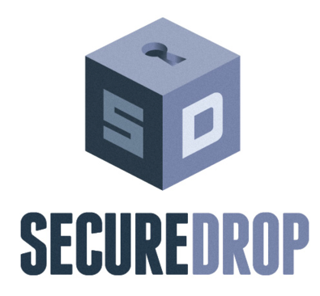

:title: Lucy Parsons Labs
:author: redshiftzero, b_meson
:description: LPL projects and SecureDrop
:keywords: activism, whistleblowing
:css: hacknight.css

----

.. image:: images/LPLlogo.png

Jennifer Helsby (``@redshiftzero``) & Freddy Martinez (``@B_meson``)

for Lucy Parsons Labs (``@lucyparsonslabs``)

----

Who was Lucy Parsons?
=====================

She was a famous labor organizer and anarchist in Chicago during the late 19th century. Once described as "more dangerous than a thousand rioters" by Chicago Police and helped found the Industrial Workers of the World (IWW)

----

Board of Directors
==================

Freddy Martinez

Jennifer Helsby

Brian Kroll

Mason Donahue

----

Our Mission
===========

The Lucy Parsons Labs is a Chicago-based collaboration between data scientists, transparency activists, and technologists which focuses on the intersection of digital rights and on-the-streets issues
----

Previous Projects
=================

* Surveillance Primer written by Jen ``https://redshiftzero.github.io/policesurveillance/``

* Resource on identifying police officers who kill ``https://lucyparsonslabs.com/resources/``

* Letter writing campaign for political prisoners

----

.. image:: images/muckrock.png

* Independent financial audit of where CPD's asset forfeiture funds are going

* CPD asset forfeiture funds were used to pay for surveillance devices like Stingray and ALPR

* Currently working with a local journalist to publish the first results of this investigation

* If you're interested in helping with FOIA see: ``https://www.muckrock.com/project/opening-the-chicago-surveillance-fund-25/``

----

Limitations of FOIA
===================

* Responses are usually late

* Responses are often over-redacted

* The most interesting records will require lawsuits to obtain

----

.. image:: images/securedrop-logo.png

* Originally written by the late Aaron Swartz, currently maintained and developed by the Freedom of the Press Foundation

* An anonymous whistleblowing system that:

  - Runs as a Tor Hidden Service for source anonymity

  - Does not log data about your browser, device, etc.

  - Encrypts submissions in transit and rest

----

SecureDrop sites
================

25 in the world (including ours), including these places:

.. image:: images/washpo-small.png
.. image:: images/theintercept.png
.. image:: images/thenewyorker-small.png
.. image:: images/propublica-small.png

----

Source Interface
================

.. image:: images/webapp-sm.png

----

Journalists
===========

.. image:: images/ali-small.jpg

**Ali Winston, Center for Investigative Reporting**

Covers law enforcement and surveillance

.. image:: images/paul-small.jpg

**Paul Gottinger, Reader Supported News**

Covers national security, the Middle East and US foreign policy

----

Leak Us Documents
=================

Reveal **illegality**, **waste**, **fraud**, **abuse**, or **public health issues** or **safety threats** by governmental bodies and corporations using LPL's SecureDrop instance:

``https://lucyparsonslabs.com/securedrop``

